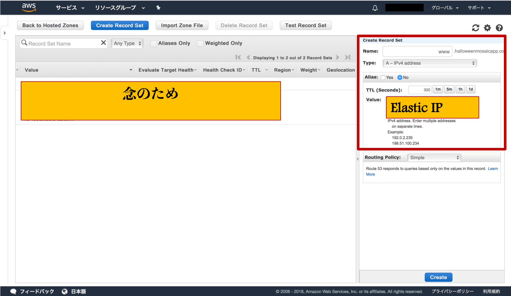

<h1>【Flask+uWSGI+NginxでWebアプリケーション作成】</h1>

***
***

<b>　とりあえず[ここ](https://github.com/iwasakishuto/Qita/blob/master/Web%20App%20memo.md)で必要なものはわかったので、実際にAWSで環境構築をしながら、その流れをメモしていく。</b>
ちなみに、できたアプリケーションは、[Trick and Treat you](http://www.halloweenmosaicapp.com) からアクセスできる。Ajaxを利用しており、画面遷移することなく楽しめる。

## インスタンスの作成
<b>　今回は、`Ubuntu Server 18.04 LTS (HVM), SSD Volume Type` を使うことにする。<br><br>インスタンスは、指示通りに作成する。注意すべきところは、<font color="Red">セキュリティグループにHTTP接続を追加すること</font><br><br><font color="Red">Elastic IPアドレスを設定し、インスタンスを再起動するたびにIPアドレスが変わらないようにすること</font>である。</b>

<b> 接続する際には、キーが公開されていないことが必要となる。<br>
`$ chmod 400 Halloween_mosaic.pem`<br>
で、モードを変更する。ちなみにこの際<br>
`$ ls -l Halloween_mosaic.pem`<br>
>`-r--------@ 1 iwasakioshuto  staff  1675 10 30 03:13 Halloween_mosaic.pem`<br>

となっていることから、ファイルの読み出しだけが許可されている状態になっていることがわかる。このときの「400」を<font color="Red">「絶対モード」</font>と言い、モードを8進数で表したものになっている。詳しくは、[ここ](https://webkaru.net/linux/chmod-command/)などを参照すること。また、<br>`sudo mv ./Desktop/Halloween_mosaic.pem .ssh/`<br>
で鍵を./ssh以下に移動しておくと管理が楽になるのでオススメする。

<b>それでは、以下のコマンドでインスタンスに接続する。<br>
`$ ssh -i .ssh/Halloween_mosaic.pem ubuntu@ec2-52-194-12-226.ap-northeast-1.compute.amazonaws.com`</b>

## 環境構築
<b>　AWSのサーバーに接続することができたら、まず始めにしなくてはならないことは環境構築である。試しに `pip` とコマンドを打ってみる。すると、

`$ pip`

>`Command 'pip' not found, but can be installed with:`
>`sudo apt install python-pip`

このように、`pip` も入っていないことがわかる。これでは必要なモジュールを入れることができないので、最低限Webアプリケーション構築に必要な情報だけでも入れておく。</b>

<b>　今回は OS が Ubuntu なので、`APT` を使用して Python から入れる。ただ、まずは APT をアップデートしておく。

`$ sudo apt-get update`

　次に、`python` のバージョンを確認する。

`$ python3 --version`
>`Python 3.6.5`

　さて、それでは `pip` をインストールする。まずは、先ほど言われたコマンドを素直に打ち込む。</b>

`$ sudo apt install python-pip`
>`Do you want to continue? [Y/n] #もちろんYes`

<b>　ちゃんと `pip` が入っていることを確認する。</b>

`$ which pip`
>`/usr/bin/pip`

<b>　ついでに、あると便利な `tree` もいれておく。</b>

`$ sudo apt  install tree`

<b>　また、エラーを調べるときにどの時間のものかわかるように、時間設定を日本にしておく。</b>

`$ date`
>`Fri Oct 19 18:25:50 UTC 2018`

`$ sudo ln -sf /usr/share/zoneinfo/Japan /etc/localtime`

`$ date`
>`Sat Oct 20 03:33:19 JST 2018`

### Nginxのインストール

<b>　それでは、諸々の必要なものをインストールする。まずは、`Nginx` を入れる。</b>

`$ sudo apt-get install nginx`

<b>　正しく入っているか確かめるために、実際に動かしてみる。</b>
```
$ sudo systemctl start nginx.service
$ sudo systemctl status nginx.service
>● nginx.service - A high performance web server and a reverse proxy server
   Loaded: loaded (/lib/systemd/system/nginx.service; enabled; vendor preset: enabled)
   Active: active (running) since Fri 2018-10-19 16:14:25 UTC; 18min ago
     Docs: man:nginx(8)
  Process: 18871 ExecStart=/usr/sbin/nginx -g daemon on; master_process on; (code=exited, status=0/SUCCESS)
  Process: 18859 ExecStartPre=/usr/sbin/nginx -t -q -g daemon on; master_process on; (code=exited, status=0/SUCCESS)
 Main PID: 18875 (nginx)
    Tasks: 2 (limit: 1152)
   CGroup: /system.slice/nginx.service
           ├─18875 nginx: master process /usr/sbin/nginx -g daemon on; master_process on;
           └─18877 nginx: worker process
Oct 19 16:14:25 ip-172-31-38-160 systemd[1]: Starting A high performance web server and a reverse proxy server...
Oct 19 16:14:25 ip-172-31-38-160 systemd[1]: nginx.service: Failed to parse PID from file /run/nginx.pid: Invalid argument
Oct 19 16:14:25 ip-172-31-38-160 systemd[1]: Started A high performance web server and a reverse proxy server.
```

<b>　「Active:」 が <font color='Green'>active (running)</font> になっていれば大丈夫。`q` を打ち、ステータス画面を閉じる。それでは、Nginx のデフォルトの設定を少し変更する。以下のコマンドを打ち込み、ファイルの編集を行う。</b>

`$ sudo vi /etc/nginx/nginx.conf`

<b>　なお、`vim` を使用する際は、「:set number」 とコマンドを打つと行数が表示されるので、使うと見やすい。ここで、62行目の `include /etc/nginx/sites-enabled/*;` をコメントアウトする。</b>

<b>　続いて、設定ファイルを作成する。</b>

`$ sudo vi /etc/nginx/conf.d/default.conf`

```
server {
    listen       80;

    location / {
        include uwsgi_params;
        uwsgi_pass unix:///usr/local/app/tmp/uwsgi.sock;
    }
}
```

<b>　最後に、Nginx関連で覚えておいた方が良いコマンドをのせる。これは、設定を変更したのにもかかわらず nginx に反映されない、ということを防ぐ。何か設定を変えたのにも関わらず反映されない時は、このコマンドを使って見ると解決されるかもしれない。</b>

`$ sudo nginx -s reload`

***

### Flaskのインストール

`$ sudo pip install flask`

### uwsgi のインストール
```
$ sudo apt install clang
$ CC=`which clang` pip install uwsgi # ファイルパスを指定している。
$ sudo apt install uwsgi-plugin-python
$ sudo apt-get install uwsgi-plugin-python3
$ sudo apt-get install libpcre3 libpcre3-dev
```

## nginx と uwsgiをつなぐ

`$ sudo vi /etc/nginx/conf.d/uwsgi.conf`

```
server {
  listen 5050;
  error_log  /var/log/nginx/error.log warn;

  location / {
    include uwsgi_params;
    uwsgi_pass unix:///usr/local/app/tmp/uwsgi.sock;
    uwsgi_ignore_client_abort on;
  }
}
```

## アプリケーションの作成

<b>　それでは、アプリケーションを作成し始めるとともに、`uwsgi` の設定を整える。</b>

`$ sudo mkdir /usr/local/app`

<b>　作成したディレクトリの所有者やグループを変える。そのために、`chown [オプション] ユーザー[:グループ] ファイル` というコマンドを打つ。グループ名を知りたい場合は、`$ sudo id ユーザー名` と打てば良い。なお、デフォルトの設定ではユーザー名、グループ名ともに `ubuntu` になっている。<br>
　<font color="Red">と思ったらそういうわけでもなかったので注意！</font>まずは、以下のコマンドで確認する。</b>
```
$ ps faux | grep nginx
>ubuntu   10458  0.0  0.1  14856  1120 pts/0    S+   01:28   0:00              \_ grep --color=auto nginx
root       813  0.0  0.1 140620  1460 ?        Ss   Oct20   0:00 nginx: master process /usr/sbin/nginx -g daemon on; master_process on;
www-data   814  0.0  0.4 143468  4776 ?        S    Oct20   0:00  \_ nginx: worker process
```

<b>　この時の `master_process` と書かれているものを 記憶する。今回は`root`</b>

`$ sudo id root`
>```uid=0(root) gid=0(root) groups=0(root)```

<b>これらを以下の`/etc/systemd/system/uwsgi.service`の該当箇所に書き込む</b>

`$ sudo vi /usr/local/app/uwsgi.ini`

```
[uwsgi]
#plugin
plugins-dir = /usr/lib/uwsgi/plugins
plugin = python27
chdir = /usr/local/app

#application's base folder
base = /usr/local/app

#python module to import
app = Halloween
module = %(app)

#socket file's location
socket = /usr/local/app/tmp/uwsgi.sock

#permissions for the socket file
chmod-socket = 666

#the variable that holds a flask application inside the module imported at line #6
callable = app

#location of log files
logto = /var/log/uwsgi/%n.log

master = true
processes = 5
vacuum = true
die-on-term = true
~                    
```

## uwsgi の設定

`$ sudo vi /etc/systemd/system/uwsgi.service`

```
[Unit]
Description=uWSGI instance to serve uwsgi
After=network.target

[Service]
User=root
Group=root
WorkingDirectory=/usr/local/app
# この下２つは、確認すること！
# /home/ubuntu/.pyenv/shims/uwsgi --ini uwsgi.ini
#Environment="LD_LIBRARY_PATH=/home/ubuntu/.pyenv/versions/anaconda3-5.0.1/lib"
#ExecStart=/home/ubuntu/.pyenv/versions/anaconda3-5.0.1/bin/uwsgi --ini uwsgi.ini
Environment="LD_LIBRARY_PATH=/usr/lib"
ExecStart=/usr/bin/uwsgi  --ini uwsgi.ini


[Install]
WantedBy=multi-user.target
```

<b>　正しいファイルパーミッションが含まれることを確認する。</b>
```
$ sudo touch /etc/systemd/system/uwsgi.service
$ sudo chmod 664 /etc/systemd/system/uwsgi.service
```
<b>　毎回起動させるのは面倒なので、自動起動を登録する。</b>

`$ sudo systemctl enable uwsgi`
>`Created symlink /etc/systemd/system/multi-user.target.wants/uwsgi.service → /etc/systemd/system/uwsgi.service.`

<b>　手動で行うとき</b>
```
$ sudo systemctl stop uwsgi.service
$ sudo systemctl start uwsgi.service
$ sudo systemctl status uwsgi.service
```
<b>　このタイミングで接続がうまくいっていないのは当たり前なので、もうしばらく設定を行う。</b>

### アプリケーションを起動する

```
$ sudo mkdir -p /usr/local/app/tmp
$ sudo chmod 777 /usr/local/app
$ sudo chown root:root /usr/local/app
$ sudo mkdir /var/log/uwsgi
$ sudo chown root:root /var/log/uwsgi
```

<b>　ローカルのデータをリモートサーバーに送る。（-rをつければディレクトリごと）<font color="Red">※ローカルで行うことに注意！</font><br>
`$ scp -r -i .ssh/Halloween_mosaic.pem ./Desktop/Halloween_app ubuntu@ec2-52-194-12-226.ap-northeast-1.compute.amazonaws.com:~/`<br>
すると、/home/ubuntu/ にデータが移動されるので、これを目的の位置に移動する。<br>
```
$ sudo mv Halloween_app/* /usr/local/app/
$ sudo rm -rf Halloween_app
```

<b> この状態で起動させると、uwsgiも正常に動作するが、どうやらプラグインがうまくいっていないようだ。IPアドレスでアクセスしても以下のページになってしまう。

</b>

<b>・必要なモジュールのインストール<br>

```
ex)
$ sudo pip install flask-bootstrap
# cachを無効にすることでMemoryErrorを防ぐ↓
$ sudo pip install --no-cache-dir tensorflow
$ sudo pip install keras
$ sudo pip install pillow
$ sudo pip install opencv-python
$ sudo pip install matplotlib
$ sudo apt-get install libsm6 libxrender1 libfontconfig1
$ sudo apt-get install python-tk'
```
</b>

<b>・エラーの処理</b>

`UnicodeDecodeError: 'ascii' codec can't decode byte 0xe3 in position 86: ordinal not in range(128)`

<b>　上記のようなエラーが出た場合、原因はローカルとサーバーでのデフォルトエンコーディングの違いである。そのことを確かめるために、`python` を起動して、以下のコードを打つ。

```
$ python
>>> import sys
>>> sys.getdefaultencoding()
'ascii'
>>> import site
>>> site.getsitepackages() # site-packages へのパスを確認する。
```

<b>　上で調べた場所に行き、`site-packages` の下に次のファイルを作成する。<br></b>
`$ sudo vi sitecustomize.py`
```
import sys
sys.setdefaultencoding('utf-8')
```

<b>　ちゃんと直せていれば、次のように出力が変わる。</b>

```
$ python
>>> import sys
>>> sys.getdefaultencoding()
'utf-8'
```

<b>　これで、アプリが正常に動くはずだ。もちろんサーバーで動かすと環境が変わるため色々と不具合は出てくるが、その都度エラーを見て対処する。
```
$ sudo cat /var/log/nginx/error.log
$ sudo cat /var/log/uwsgi/uwsgi.log
$ sudo cat /var/log/syslog
```
この３つは、何度も参照することになる。
例えば、
`bind(): No such file or directory [core/socket.c line 230]``
mkdir -p /usr/local/app/
sudo chown -R root:root /usr/local/app/
sudo chmod 777 /usr/local/app/
というエラーが出ることがある。

### python のデフォルト version 変更
```
$ sudo apt-get install python3.6 python3.6-dev
$ sudo wget https://bootstrap.pypa.io/get-pip.py
$ sudo python3.6 get-pip.py
$ python3.6 --version >>Python 3.6.6
```
<b>　`python3.6` が入った。しかし、このままでは `python` のデフォルトバージョンは `python2.7.15rc1` のままである。</b>

```
$ python --version
```
>`Python 2.7.15rc1`

<b>初めに試した、画期的な（ように見える）方法<br>
→`alias`を利用する。<br>
>エイリアス (alias) は「別名」を意味する言葉である。 alias (コマンド) - UNIXなどにおいてコマンドを別名で登録したもの。 別名を登録するコマンド名のこと。</b>

`$ alias python='python3'`

```
$ python --version
```
>`Python 2.7.15rc1`

<b>　薄々予感はしてたのですが、やはりダメでした。単にショートカットキーを割り当てたようなものですから、大元は変わってないようです。<br>
→だったら大元から変更する。</b>

`$ sudo vi ~/.bash_profile`
>alias python=python3 を書き込む

`$ source ~/.bash_profile`

`$ python --version`
>`Python 3.6.6`

<b>　いけた。ように見えたが、これはダメで、結局アプリケーションを実行する際には`Python 2.7.15rc1`が動いていた。</b>

### Pyenv を利用する
```
$ git clone https://github.com/yyuu/pyenv.git ~/.pyenv
$ echo 'export PYENV_ROOT="$HOME/.pyenv"' >> ~/.bash_profile
$ echo 'export PATH="$PYENV_ROOT/bin:$PATH"' >> ~/.bash_profile
$ echo 'eval "$(pyenv init -)"' >> ~/.bash_profile
$ source ~/.bash_profile
$ pyenv install 3.6.6 #これでいけるはずだが、うまくいかない。
>BUILD FAILED (Ubuntu 18.04 using python-build 1.2.7-11-g835707da)
```

<b>どうやら、`Ubuntu 18.04`のデフォルト設定が`Python 2.7.15rc1`であるがゆえに設定を崩す恐れがあり、うまくいかないようだ。インスタンスを`UBuntu Version 16.0`にした方が都合が良いかもしれない。</b>

`$ pyenv install anaconda3-5.0.1 # anacondaを試して見る。`
>`-> https://repo.continuum.io/archive/Anaconda3-5.0.1-Linux-x86_64.sh
Installing Anaconda3-5.0.1-Linux-x86_64...
Installed Anaconda3-5.0.1-Linux-x86_64 to /home/ubuntu/.pyenv/versions/anaconda3-5.0.1`

<b>　成功した。</b>

```
$ python --version
>Python 2.7.15rc1 # もちろんまだ変わっていない
$ pyenv global anaconda3-5.0.1`
$ echo 'export PATH="$PYENV_ROOT/versions/anaconda3-5.0.1/bin:$PATH"' >> ~/.bashrc
$ echo 'export PATH="$PYENV_ROOT/versions/anaconda3-5.0.1/bin:$PATH"' >> ~/.bash_profile
$ python --version
>Python 3.6.3 :: Anaconda, Inc. # 変わった！
```
<b>　これで、python3がデフォルトで利用できるようになった。</b>
```
# uwsgiやFlask、その他の基本パッケージも忘れずに入れておく。
$ conda update cond
$ conda update anaconda
$ conda install -c conda-forge uwsgi
$ conda install -c anaconda flask
$ conda install -f python
```

## ドメインを取得する
<b>　Webアプリケーションが作成できたら、ドメインを取得して公開したいと考えるだろう。そこで、AWSでのドメインの取得方法を非常に簡単に記す。(お名前.comの場合は[ここ](https://github.com/iwasakishuto/Qita/blob/master/Get%20Domain.md))</b>
<b>　ここを選択し、取得したいドメイン名を検索する。</b><br>

<b>　早い者勝ちなので、取得している人がいないドメインを見つけ、選択して購入をする。</b><br>

<b>　購入したドメインがあることを確認したら、選択し、「Go to Record Sets」を選択。</b><br>

<b>　画面右側のNameに「www」、valueにElasticIPアドレスを入力する。少し待てば結果が反映される。</b><br>

