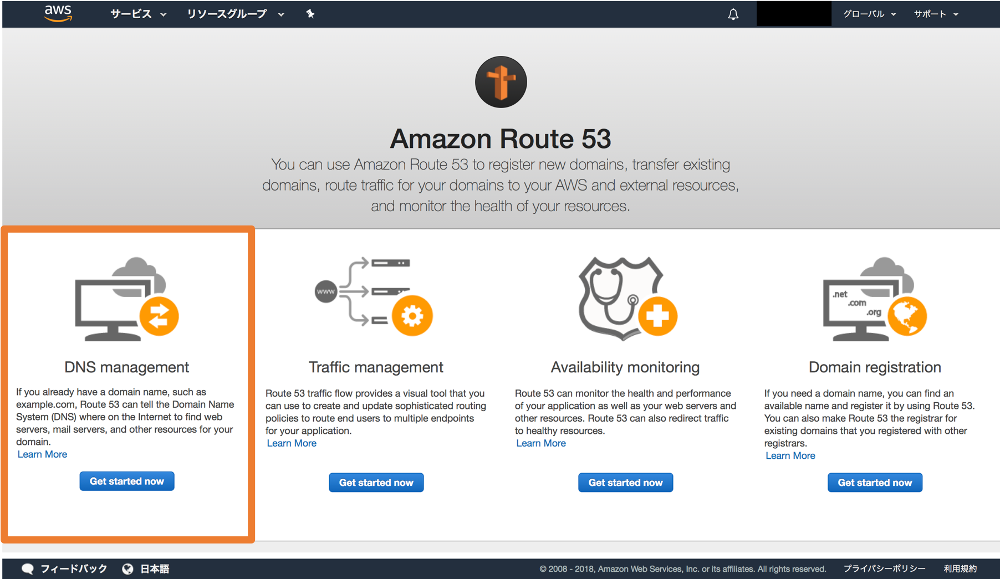
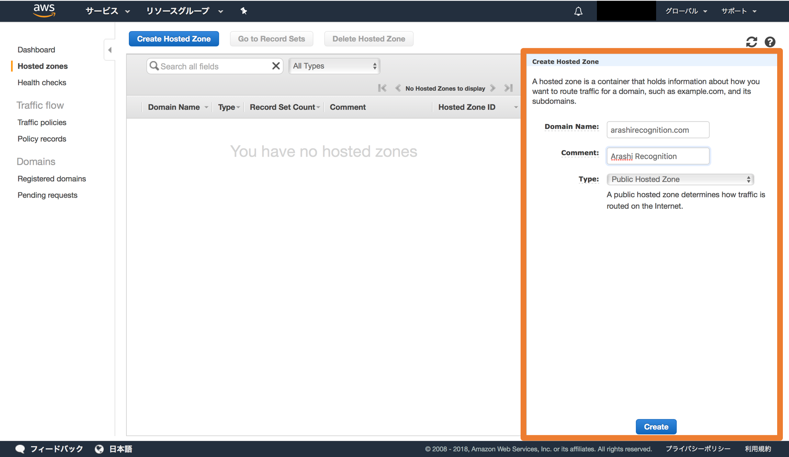
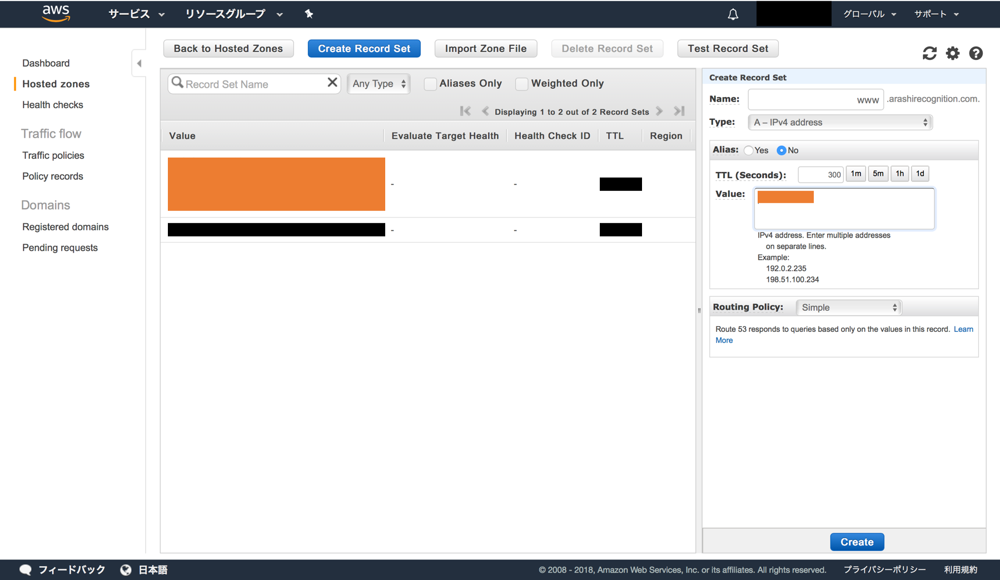
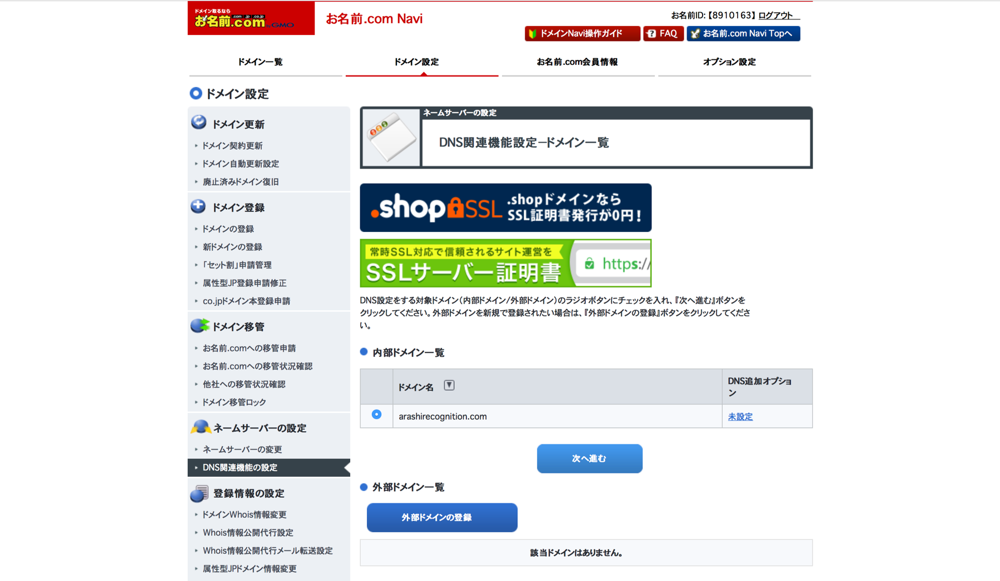
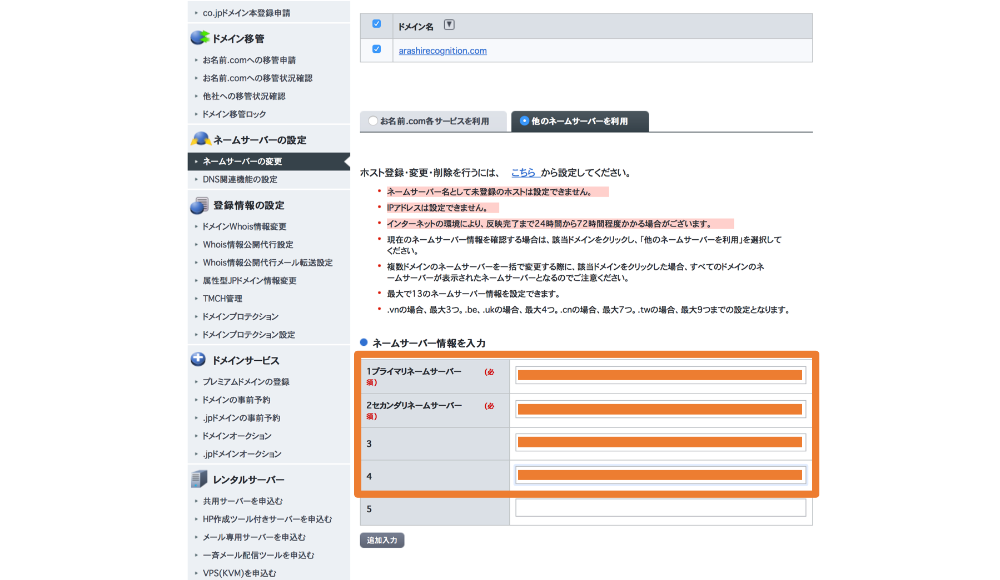

<h1>【ドメインを取得する】</h1>

<b>※AWSのEC2を利用してWebアプリケーションを作成しています。</b>

<b>
◯全体の流れ
1. webサイトを作成する
2. ドメインを取得する
3. 使用するDNSサーバ（ネームサーバ）を設定する
4. DNSサーバでドメインとIPアドレスを紐づける設定をする
</b>

<b>　今までで `1` が終了したので、ここでは `2~4` をまとめて行う。が、その前に一度言葉の確認をしておく</b>

***

<h2>・IPアドレス</h2>

<b>　IPアドレスは、住所のようなものである。web上には多種多様なサイトが存在するため、それぞれのサイトを一意に定める値が必要であり、それがIPアドレスである。例としては、以下のものがある。
<li>127.0.0.1（ローカルホスト。利用者が現在使用している端末のアドレス）</li>
<li>216.58.193.78 ( `GoogleのIPアドレス`) </li>
</b>

<h2>・ドメイン名</h2>

<b>　さて、上述の例より、もちろん [216.58.193.78](http://216.58.193.78) と検索すれば、Googleのにつながる。しかし、今までにこの方法でGoogleの検索エンジンを利用したことがある人はいるだろうか？おそらくいないと思う。僕らがGoogleを使う際は [google.com](https://www.google.com) と検索する。これにより、ただの数字の羅列から意味のある言葉に変換され、ネットが使いやすくなっている。ちょうど僕らがどこかに出かける時に、「『東京都港区芝公園４丁目２−８』に行く」と言わずに、「『東京タワー』に行く」というようなものだ。 
　では、どのようにして google.com と 216.58.193.78 を一対一で対応させているのだろうか？その答えが、次に述べるDNS(ドメインネームシステムである。</b>

<h2>・DNS</h2>

<b>　DNS(ドメインネームシステム)は、ドメイン名とIPアドレスを対応づけるもので、土地台帳のようなものである。しかし、世の中にはWebサイトが際限なくあるし、今後も増え続けるだろう。そうすると、全員が同じ対応表を参照しに行ってドメイン名からIPアドレスを取得していたら、混雑してしまうと考えられる。そこで、台帳を分散させた。そのうちの１つ１つがDNSサーバ（ドメインネームサーバ、ネームサーバ）と呼ばれるものである。 
　したがって、ドメインネームを取得した後にネームサーバーを登録する必要がある。それによって、ついにIPアドレスとドメイン名を対応づけることができる。</b>

***
***

<h1>◯ドメイン名の取得</h1>

<b>　それではまずはドメイン名を取得する。今回は、[お名前.com](https://www.onamae.com/?btn_id=navi_top_domain_logo)というサイトを利用する。方法はいたって簡単で、希望するドメイン名を検索し、同じ名前が使われていなければそれを買うことができる。ちなみに今回は `arashirecognition.com` というドメイン名を買った。それでは次にDNSサーバーを設定する。</b>

***

<h1>◯DNSサーバーの設定</h1>

<b>　まずはAWSのインスタンスに行き、自分のサーバーのIPアドレスを確認する。（なお、ここで Elastic IP を利用してIPアドレスを固定していないと大変なことになるので、注意が必要である。） 
　IPアドレスがわかったら、マネジメントコンソールでRoute53に移動し、一番左のDNS management から、Get started now を選択する。</b>

<b>　Create Hosted Zone を選択して、右に出てくるところに、使いたいドメイン名を入れ( www. などは入れず、 xxxxx.jp や xxxxx.com という部分だけ)、作成する。</b>

<b>　作成されたNSレコードを全て記録し、Create Record Setを選択する。以下のものを書き込み、Create
<li>Name : www</li>
<li>Type : A-IPv4 address</li>
<li>Value : IPアドレス</li>

<b>　続いて、ドメイン名を取得したサイト（お名前.com）に移動する。「DNS関連機能の設定」を選択し、次へ進む。</b>

<b>　先ほど記録したNSレコードを入力する。（※なお、最後のピリオドを取ることに注意）</b>

<b>　エラーが起こらなければ、これで設定は終了になる。あとは、設定が反映されるのを待つ。なお、ターミナルで以下のコマンドを打って確認をすることもできる。 
`$ nslookup -type=ns arashirecognition.com`
>`Server:		192.168.32.1
Address:	192.168.32.1#53
Non-authoritative answer:
arashirecognition.com	nameserver = ns-840.awsdns-41.net.
arashirecognition.com	nameserver = ns-112.awsdns-14.com.
arashirecognition.com	nameserver = ns-1394.awsdns-46.org.
arashirecognition.com	nameserver = ns-1793.awsdns-32.co.uk.
Authoritative answers can be found from:
ns-112.awsdns-14.com	internet address = 205.251.192.112
ns-1394.awsdns-46.org	internet address = 205.251.197.114
ns-1793.awsdns-32.co.uk	internet address = 205.251.199.1
ns-840.awsdns-41.net	internet address = 205.251.195.72
ns-112.awsdns-14.com	has AAAA address 2600:9000:5300:7000::1
ns-1394.awsdns-46.org	has AAAA address 2600:9000:5305:7200::1
ns-1793.awsdns-32.co.uk	has AAAA address 2600:9000:5307:100::1
ns-840.awsdns-41.net	has AAAA address 2600:9000:5303:4800::1
`
