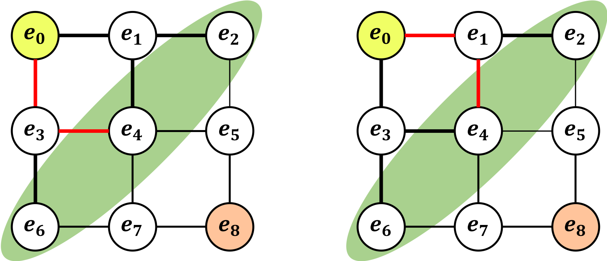
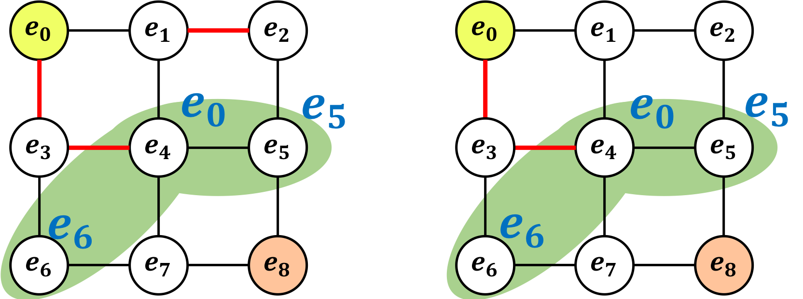
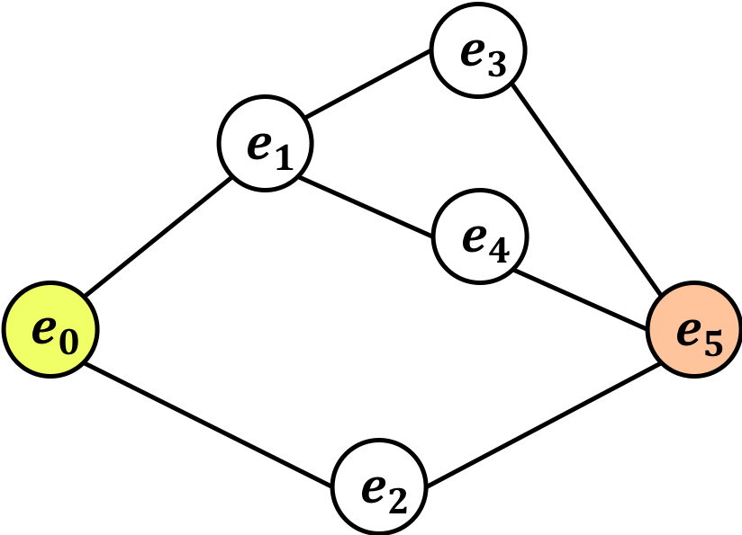
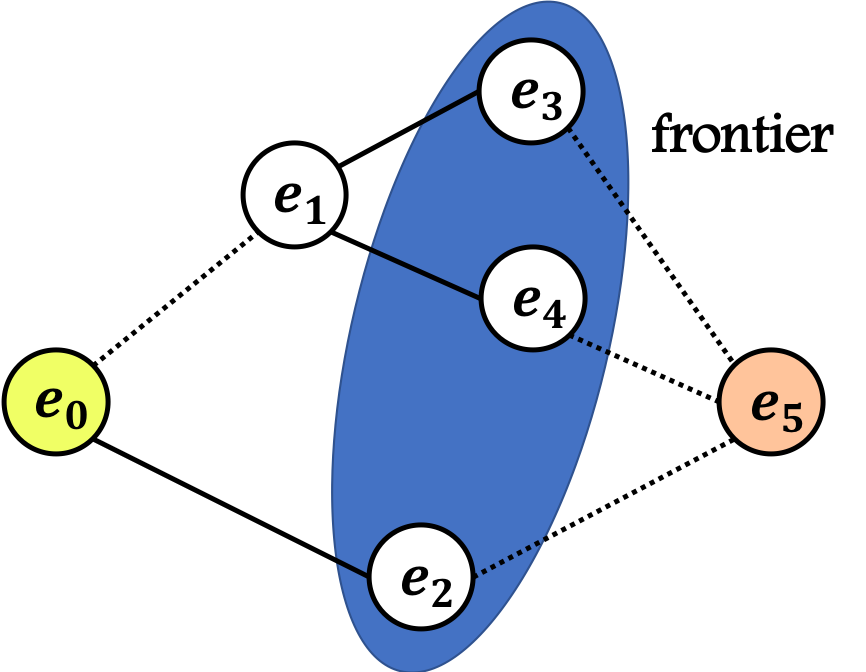
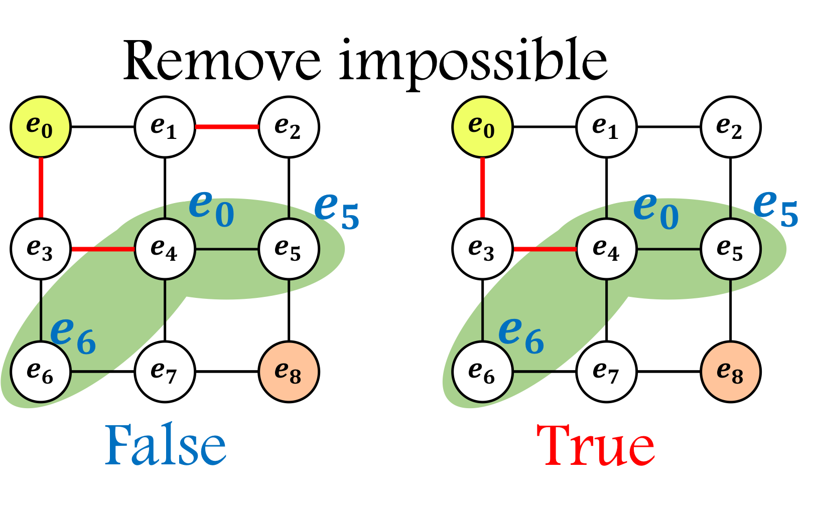
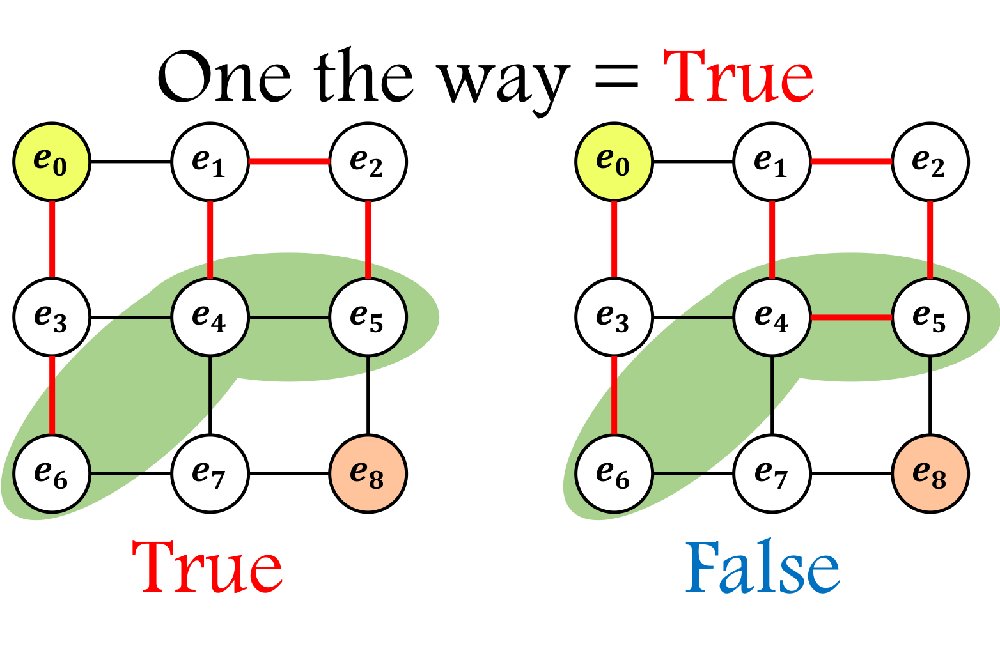
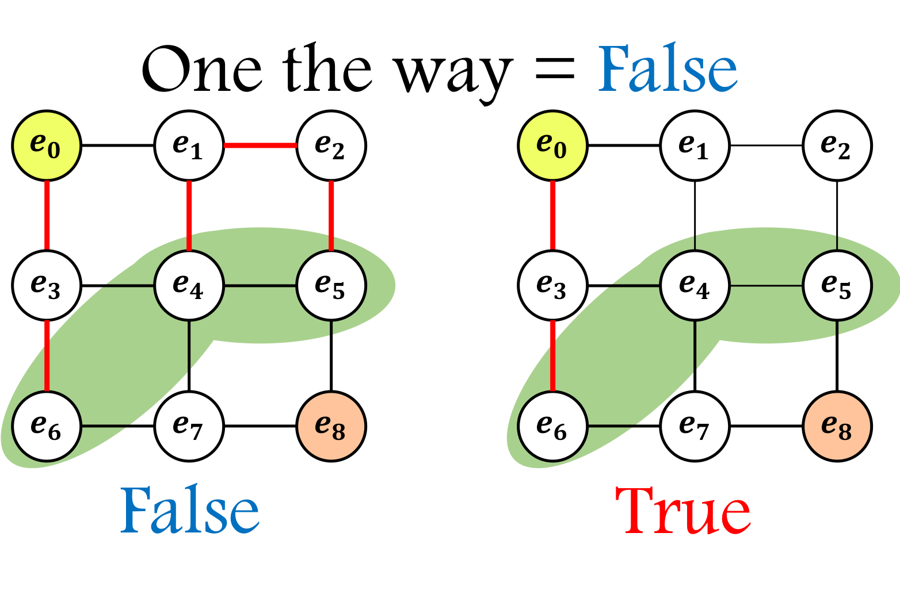
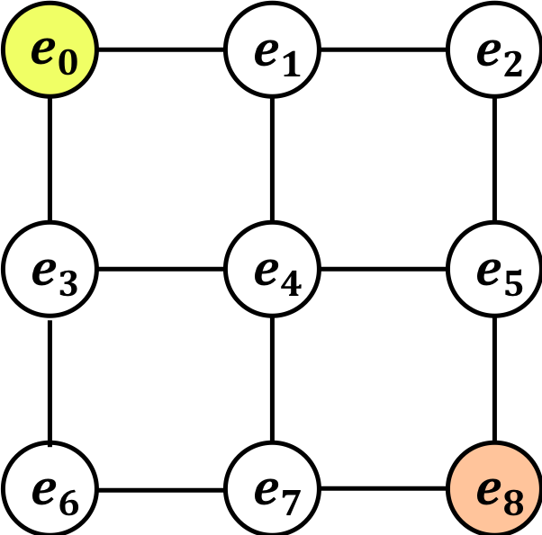
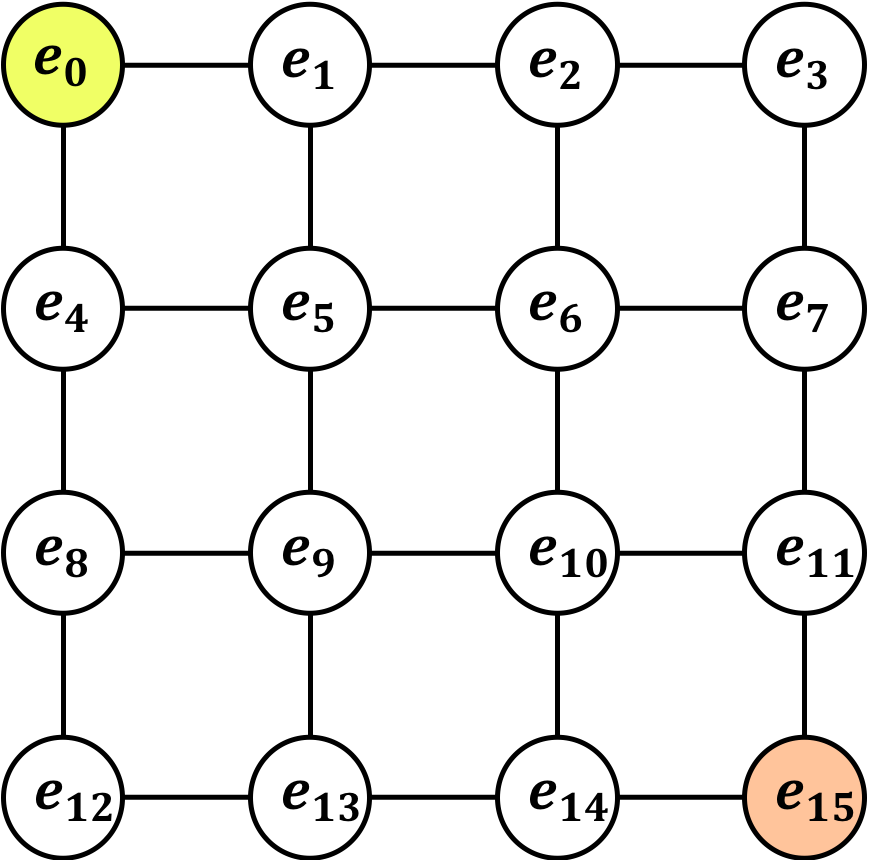

# ZDDとは
　ZDD(Zero-suppressed Binary Decision Diagram)とは二分木の一種であり、**「圧縮」**と**「剪定」**という特徴を持っている。あるノードからあるノードまでの全経路（同じノードを通らず一本道）を探索する問題が有名で、[フカシギの数え方](https://www.youtube.com/watch?v=Q4gTV4r0zRs&feature=youtu.be)という動画が一時期流行った。<br>
　その動画内で紹介されていた、ZDDを簡単に実装するgraphillion（読み方はグラフィリオン）というライブラリがあり、pythonとC++で利用できる。（実際に利用した流れは[こちら]()）<br>
　今回はZDDを１から作成したので、それを紹介する。まずは、簡単に「圧縮」と「剪定」について説明する。

# 圧縮とは
　圧縮とは「等価な経路をひとまとめにする」方法である。例えば、以下の２つの経路を考える。

 この２つの経路は等価だろうか？「等価である」と思ったかもしれないが、答えは「わからない」である。というのもこの状態の時にどのエッジが残っているのかという情報が一切ないからである。そこで、次の「フロンティア」という考え方を導入する。

 ## フロンティア
 　終了したエッジと未処理のエッジとの間にあるノードを「フロンティア」と呼ぶ。例えば、下図のグラフを考える。（この時終了したエッジを太くしてある）この場合フロンティアは緑部分である。また、この状態ならば、以下の２つの経路は等価である、ということができる。
 
 　次に、これら２つが等価であることをアルゴリズム化する上で大切「mate配列」について説明する。

 ## mate配列
 　mate配列は 、**ZDD** の最重要事項であり、接続情報を記録する。このとき（基本的には）以下のルールに基づいて値を決める。
 1. 頂点がパスの端にある場合→逆の端の頂点
 2. 頂点がパスの途中にある場合→0
 3. 頂点がいずれのパスにも含まれない場合→自分自身

　そして、フロンティアのmate配列が等しければ２つの経路は等価である、と考えることができる。

# 剪定とは
　ここまでで圧縮についてある程度理解したと思うが、勘の良い方は上の考え方だと「不正解の経路も『等価である』と考えてしまうのではないか？」と思うだろう。それは正しくて、例えば以下の例があげられる。

　これらは「等価である」と言えてしまうが、左の図はこの後どうやっても一本道でe0からe8に行くことができない。<br>
　そこで利用するのが「剪定」という考え方である。「剪定」とは既に不正解であることが確定している経路を削除する、ということである。

## アルゴリズム
　それでは実際に作成したアルゴリズムを紹介する。なお、グラフを有向グラフとみなし、入次数（あるノードに入るエッジの数）、出次数（あるノードから出て行くエッジの数）を考えている。

### フロンティアの更新
```
def update_frontier(frontier,edge,edges,counter):
    """
    関数の概要：以前までのフロンティアと獲得エッジからフロンティアを更新する。フロンティアは全ての場合で等しいので、一括計算。
    　　　　　　一般に、１つの頂点で、「入次数の数ー１」だけフロンティアは増える。
    @param frontier ：以前までのフロンティア
    @param edge     ：新規獲得エッジ
    @param edges    ：エッジ集合
    @param counter  ：エッジの入次数を記録している辞書
    @return frontier：更新後のフロンティア
    """
    # 入次数が２で、新しい辺の終点の頂点番号が小さかったら追加するだけ。
    if counter[edge[0]] == 2 and edge[1] == [edges[i][1] for i in range(len(edges)) if edges[i][0] == edge[0]][0]:
        frontier.append(edge[1])
    # 入次数が２で、新しい辺の終点の頂点番号が大きかったら始点を削除して終点を追加する。
    elif counter[edge[0]] == 2 and edge[1] == [edges[i][1] for i in range(len(edges)) if edges[i][0] == edge[0]][1]:
        frontier.remove(edge[0])
        frontier.append(edge[1])
    # 入次数が１の場合は、始点を削除して終点を追加する。
    elif counter[edge[0]] == 1:
        frontier.remove(edge[0])
        frontier.append(edge[1])
    else:
        print("予想外のedge: {}です!!".format(edge))

    # 重複を削除する。
    new_frontier = list(set(frontier))
    return new_frontier
```
　これを逐次的に利用することでフロンティアの遷移を表示する関数`print_frontier`も作成した。（本質とは関係がないため省略）それを用いると、
```
# 辺の集合
edges = [("e0","e1"),("e0","e2"),("e1","e3"),("e1","e4"),("e2","e5"),("e3","e5"),("e4","e5")]
# フロンティアの遷移を確認する。
print_frontier(edges)
>>>00: initial frontier:              ['e0']
   01: new_edge:('e0', 'e1') frontier:['e1', 'e0']
   02: new_edge:('e0', 'e2') frontier:['e1', 'e2']
   03: new_edge:('e1', 'e3') frontier:['e1', 'e3', 'e2']
   04: new_edge:('e1', 'e4') frontier:['e4', 'e3', 'e2']
   05: new_edge:('e2', 'e5') frontier:['e4', 'e3', 'e5']
   06: new_edge:('e3', 'e5') frontier:['e4', 'e5']
   07: new_edge:('e4', 'e5') frontier:['e5']
```


### mate配列の更新
```
def update_mate_arr(mate, frontier, current_edges):
    """
    関数の概要：mate配列を更新する。
    @patam mate         ：以前までのmate配列（dict）
    @param frontier     ：更新後のフロンティア
    @param current_edges：獲得したエッジ集合
    @return new_mate    ：更新後のmate配列（dict）  
    """
    start = list(mate.keys())[0]
    end   = list(mate.keys())[-1]
    for f in range(len(frontier)):
        flag=False # ループに入るかの識別子
        loop = 0   # ループの回数を記録する。
        # 獲得したエッジ集合から、フロンティアの入次数を求める。
        in_edges  = [current_edges[i][0] for i in range(len(current_edges)) if current_edges[i][1] == frontier[f]]
        out_edges = [current_edges[i][1] for i in range(len(current_edges)) if current_edges[i][0] == frontier[f]]
        N_in  = len(in_edges)
        N_out = len(out_edges) # 出自数の数  
        # 入次数、出次数共に０だったら、頂点の名前になる。
        if N_in+N_out == 0:
            mate[frontier[f]] = frontier[f]
        # 入次数と出次数の和が２(=途中にある)の場合は０。    
        elif N_in + N_out>=2:
            mate[frontier[f]] = "0"
        # 入次数が１つだったら、逆端まで探索する。
        elif N_in == 1:
            edge = in_edges[0]
            b_edge = frontier[f] # １つ前のedgeを記録
            flag = True
        # 入次数は０だが、出次数が１の場合
        elif N_out == 1:
            edge = out_edges[0]
            b_edge = frontier[f]
            flag=True           
        # 探索を続ける。
        while flag and loop<len(current_edges): # 全てエッジを通っても終わらない＝ループが起きている。
            in_edges  = [current_edges[i][0] for i in range(len(current_edges)) if current_edges[i][1] == edge]
            out_edges = [current_edges[i][1] for i in range(len(current_edges)) if current_edges[i][0] == edge]
            N_in  = len(in_edges)  # 入次数の数
            N_out = len(out_edges) # 出自数の数                           
            # 端にたどり着いた場合
            if N_in + N_out == 1:
                mate[frontier[f]] = edge
                break
            # 端ではない場合は、端まで探索する。
            elif N_in == 2:
                if edge==end and loop!=0:
                    mate[frontier[f]] == "1"
                    break
                tmp = edge
                edge = [in_edges[i] for i in range(len(in_edges)) if in_edges[i]!=b_edge][0]
                b_edge = tmp
            elif N_out == 2:
                if edge== start and loop!=0:
                    mate[frontier[f]] == "1"
                    break
                tmp = edge
                edge = [out_edges[i] for i in range(len(out_edges)) if out_edges[i]!=b_edge][0]
                b_edge = tmp
            elif N_in==1 and N_out==1:
                tmp_edges = in_edges+out_edges
                tmp = edge
                edge = [tmp_edges[i] for i in range(len(tmp_edges)) if tmp_edges[i]!=b_edge][0]
                b_edge = tmp  
            loop+=1
        # 「エッジの数だけ遡っても端につかない」＝「ループができている」ため、削除する。
        if loop!=0 and loop==len(current_edges):
            for k in range(len(frontier)):
                mate[frontier[k]] = "0"
            return mate
    return mate
```
　同じく、mate配列を表示する関数`print_matearr`を作成した。それを用いると、
```
# 辺の集合
edges = [("e0","e1"),("e0","e2"),("e1","e3"),("e1","e4"),("e2","e5"),("e3","e5"),("e4","e5")]
# 頂点の集合
vertex_set = ["e0","e1","e2","e3","e4","e5"]
check_edges = [("e0","e2"),("e1","e3"),("e1","e4")]
print_matearr(vertex_set, edges, check_edges, 4)
>>>04: new_edge     :('e1', 'e4') ◯
       mate array   :{'e2': 'e0', 'e3': 'e4', 'e4': 'e3'}
       current edges:[('e0', 'e2'), ('e1', 'e3'), ('e1', 'e4')]
```


### 剪定
　剪定をするには２つのアルゴリズムが必要であるが、まず１つ目は、以下のような例を取り除くアルゴリズム `Remove_impossible` である。

```
def Remove_impossible(edges, frontier, start):
    """
    関数の概要：フロンティアに一続きで繋がっているかを確かめる。ただし、ループが含まれてしまう。
    @param edges   ：取得している辺の集合
    @param frontier：その時のフロンティア
    @param start   ：開始点(e0)
    """
    edge_elements = Flatten_dual(edges)
    counter = collections.Counter([edge for edge in edge_elements])
    check_list = [k for k, v in counter.items() if k not in frontier]
    if start in check_list: check_list.remove(start)
    for i in range(len(check_list)):
        if counter[check_list[i]] == 1:
            return False
    return True

def Flatten_dual(dual_list):
    """
    関数の概要：二重リストを一重にする関数
    """
    return [element for inner_list in dual_list for element in inner_list]
```

　中身を見ていただければわかると思うが、この時以下のようなものが残ってしまう。そこで、さらに `One_stroke` という関数を定義する。


```
def One_stroke(edges, frontier_mate_dict, start, on_the_way):
    """
    関数の概要：一筆書きの集合かを判断する関数（ループを除く）
    @param edges               ：調べたいエッジ
    @param frontier_mate_dict  ：mate配列
    @param start               ：始点
    @param on_the_way          ：終点までつながっていない=True
    @return：True or False
    """
    # フロンティア同士が繋がっているものの片方のフロンティアを残す。また、e0に繋がっているフロンティアも除く。
    together = [k for k,v in frontier_mate_dict.items() if (k in frontier_mate_dict.values()) and k<v and k!=start]
    out_edges = [edges[i][1] for i in range(len(edges)) if edges[i][0] == start]
    if len(out_edges)!=1: return False
    edge = out_edges[0]
    b_edge = start
    count = how_many_edges(edges, start)
    if on_the_way:
        # フロンティア同士が繋がっているものがあれば、それも考える。
        for i in range(int(len(together))):
            count += how_many_edges(edges, together[i])

    return count==len(edges)
```
　なお、この関数は`on_the_way` という引数を `False` にするだけで、終点にエッジが繋がった時にそれが正解ルートなのか確かめることができる。（例えば、e6が終点とすると先ほど`True`だった左の図が`False`となる。）


### メインの関数
　それでは、これらを統合してお姉さんを救う。
```
def rootnum(vertex_set, edges, flag=False):
    """
    関数の概要：ルートの総数を調べる。
    @param vertex_set ：グラフの頂点集合
    @param edges      ：グラフの辺の集合
    @param flag       ：等価なエッジ集合を表示するか
    """
    start = vertex_set[0]     # 始点
    end   = vertex_set[-1]    # 終点
    frontier = vertex_set[:1] # フロンティアの初期化。
    mate_dict = dict()        # mate配列の初期化。
    for i in range(len(vertex_set)): mate_dict[vertex_set[i]] = vertex_set[i]
    counter = collections.Counter([edge[0] for edge in edges]) # フロンティアの更新に利用する。
    answer = 0                # 求めたいルートの数
    answer_list = []          # 求めたいルート（等価なものに圧縮済）

    edges_set = [[[],1,mate_dict]] # 初期化
    for i in range(len(edges)):
        # 新しいノードを獲得する処理
        frontier = update_frontier(frontier, edges[i], edges, counter) # フロンティアの更新。
        edges_set_get = copy.deepcopy(edges_set) # 新規のエッジを獲得する方
        edges_set_not = copy.deepcopy(edges_set) # 新規のエッジを獲得しない方
        for j in range(len(edges_set_get)):
            edges_set_get[j][0].append(edges[i])
        edges_set = edges_set_not+edges_set_get # 順番意外と大事（より簡単な方を等価なものの代表にできる。）

        for j in range(len(edges_set)):        # mate配列の更新。
            edges_set[j][2] = update_mate_arr(edges_set[j][2],frontier,edges_set[j][0])

        # [frontierのmate配列]をkey,[取得edges,等価なものの個数,mate配列]をvalueにする。
        result_dict = dict() # 圧縮をするためdictionaly型。
        for j in range(len(edges_set)):
            mate_arr = edges_set[j][2]  # 全てのmate配列(dictionaly型)
            mate_arr_frontier = dict([(k,v) for k,v in mate_arr.items() if k in frontier]) # フロンティア部分のみ
            mate_key = "".join(mate_arr_frontier.values()) # 文字を結合することで key にする。
            get_edges = edges_set[j][0] # 獲得したエッジ
            num = edges_set[j][1]       # これより前で圧縮された等価なものの数
            """
            ここで、既に不正解だとわかっているものを取り除く。
            ・フロンティア配列のmate配列のvalueにe0が存在しない。（これだとe0からエッジがないものも含まれる。）
            ・１つのノードから３本以上のエッジが出ている。
            ・ループができている。
            """
            if start in mate_arr_frontier.values(): # フロンティアのmate配列に始点が含まれないものを取り除く。
                if Remove_impossible(get_edges, frontier, start): # 既に無理なものを取り除く。
                    if start in Flatten_dual(get_edges): # 始点が獲得エッジに含まれているもののみにする。
                        if One_stroke(get_edges, mate_arr_frontier, start, True): # ループが複数ノードを取り除く。
                            if end in frontier and mate_arr_frontier[end] == start:
                                if One_stroke(get_edges, mate_arr_frontier,start, False):
                                    if flag: answer_list.append({"num":num,
                                                                 "route":get_edges}) # 必要であれば最後まで行ったパスを記憶する。
                                    answer+=num
                                    continue
                        else:
                            continue
                    """フロンティア部分のmate配列が等しいものを圧縮する。"""
                    # mate配列の同じものがあれば、エッジ数の少ないものを残して圧縮する。
                    if mate_key in result_dict:
                        result_dict[mate_key][1] += num # 等価なものは圧縮する。
                    else:
                        result_dict[mate_key] = [get_edges, num, mate_arr]

        # 圧縮後を回収する。
        edges_set = []
        for k,v in result_dict.items():
            edges_set.append([v[0],v[1],v[2]])

    print("{} から {} までのルートの総数は {} 通りです。".format(start,end,answer))
    if flag: return answer_list
```

## 実用例
### 例１

```
# 辺の集合
edges = [("e0","e1"),("e0","e2"),("e1","e3"),("e1","e4"),("e2","e5"),("e3","e5"),("e4","e5")]
# 頂点の集合
vertex_set = ["e0","e1","e2","e3","e4","e5"]
rootnum(vertex_set, edges, True)
>>> e0 から e5 までのルートの総数は 3 通りです。
   [{'num': 1, 'route': [('e0', 'e2'), ('e2', 'e5')]},
    {'num': 1, 'route': [('e0', 'e1'), ('e1', 'e3'), ('e3', 'e5')]},
    {'num': 1, 'route': [('e0', 'e1'), ('e1', 'e4'), ('e4', 'e5')]}]
```

### 例２

```
rootnum(vertex_set, edges, True)
>>>e0 から e8 までのルートの総数は 12 通りです。
   [{'num': 4, 'route': [('e0', 'e1'), ('e1', 'e2'), ('e2', 'e5'), ('e5', 'e8')]},
    {'num': 2, 'route': [('e0', 'e3'),('e1', 'e2'),('e1', 'e4'),('e3', 'e6'),
                         ('e2', 'e5'),('e4', 'e7'),('e6', 'e7'),('e5', 'e8')]},
    {'num': 6, 'route': [('e0', 'e1'), ('e1', 'e4'), ('e4', 'e7'), ('e7', 'e8')]}]
```

### 例３

```
rootnum(vertex_set, edges, True)
>>>e0 から e15 までのルートの総数は 184 通りです。
   [{'num': 54, 'route': [('e0', 'e1'),('e1', 'e2'),('e2', 'e3'),
                          ('e3', 'e7'),('e7', 'e11'),('e11', 'e15')]},
    {'num': 38, 'route': [('e0', 'e1'),('e1', 'e5'),('e2', 'e3'),('e2', 'e6'),
                          ('e5', 'e9'),('e3', 'e7'),('e6', 'e10'),('e9', 'e13'),
                          ('e7', 'e11'),('e10', 'e14'),('e13', 'e14'),('e11', 'e15')]},
    {'num': 92, 'route': [('e0', 'e1'),('e1', 'e2'),('e2', 'e6'),
                          ('e6', 'e10'),('e10', 'e14'),('e14', 'e15')]}]
 ```

　例３の処理でも、0.1秒程度というかなり早い時間で処理を終えることができる。剪定と圧縮を行わないと１分で終わるような処理ではない。(CPUの性能にもよるが)アルゴリズムの凄さを改めて実感した。

# 参考資料
[フロンティア法 - 組合せ問題の解を列挙 索引化するZDD構築アルゴリズム](http://www-lsm.naist.jp/~jkawahara/frontier/frontier_lec.pdf)
(北海道大学 情報科学研究科 川原純助教のスライド)
