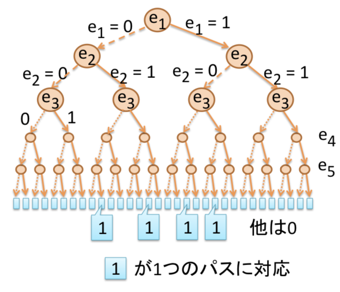
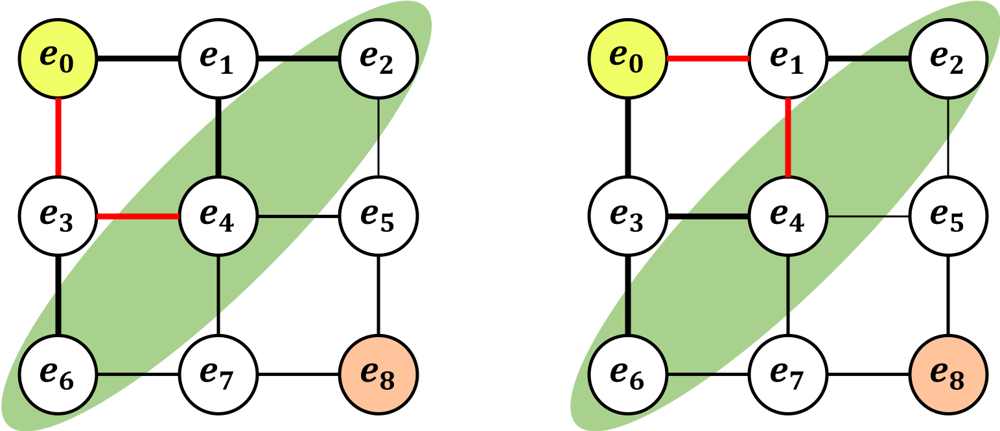

# はじめに
　まずは[フカシギの数え方](https://www.youtube.com/watch?v=Q4gTV4r0zRs&feature=youtu.be)を見ていただきたい。これは、日本科学未来館で平成24年8月1日(水) ～ 平成25年4月15日(月)の間に公開されていたアルゴリズムの重要性をわかりやすく示した有名な動画である。この動画でわかる通り、アルゴリズムを使うことで計算時間を大幅に短縮することができる。
　そこで、動画内で紹介されていたアルゴリズムをgraphillion（読み方はグラフィリオン）というライブラリを用いてpythonで実際に計算してみる。
# graphillionとは
　graphillionとは、グラフ集合を扱うためのライブラリであり、PythonやC++で実行することができ、パスや全域木、マッチングなど、様々な対象を列挙できる。
　今回は、このグラフ集合ライブラリgraphillionのチュートリアルを実際にpythonで行い、実用性を実感する。


# インストール
　まずはgraphillionをインストールする。詳しくは[Github](https://github.com/takemaru/graphillion#graphillion---fast-lightweight-library-for-a-huge-number-of-graphs)を見てもらいたいが、実際にインストールした手順を示す。なお、環境は MacBook ProのIntel Core i5(64bit)で、Python 3.6.3 である。
　なお、`networkx`と`matplotlib`は必須ではないが、チュートリアルでグラフ図示をする際に必要となる。

```
pip install networkx
pip install matplotlib
pip install graphillion
```
　以上のコマンドを打つと、自分のOSとpythonのバージョンに合わせた最適なバージョンがインストールされる。

# チュートリアル
　それでは、チュートリアルを行う。

```
# 必要なモジュールのインポート
from graphillion import GraphSet
import graphillion.tutorial as tl
```
　まずは、動画でお姉さんが命をかけて挑んでいたグリッドの問題を解く。

```
# グリッドのサイズを指定
universe = tl.grid(2, 2) # 3×3のグリッドになることに注意！
GraphSet.set_universe(universe)
tl.draw(universe)
```
　この時、`tl.draw(universe)`で考えているグラフを図示できるので、便利である。今回考えているグリッドは、以下のようになる。


　それでは、実際に経路が何本あるのかを計算する。

```
start = 1 # スタート位置
goal = 9 # ゴールの位置
paths = GraphSet.paths(start, goal)
len(paths)
>>> 12
```
　正しい答えも以下の通り12通りである。


　それではここで、この問題の派生問題を解いてみる。「指定された２箇所を指定された順番で通る」という制約付きで道順が何通りあるかを調べる。（チュートリアルでは、"key is picked up before reaching the treasure box" として紹介されている。）

```
key = 4        # 1箇所目
treasure = 2   # 2箇所目
paths_to_key = GraphSet.paths(start, key).excluding(treasure)
treasure_paths = paths.including(paths_to_key).including(treasure)
len(treasure_paths)
>>> 2
```
　ここでも正しく計算された。（もちろん選ばれたのは以下の２つ）


　それでは最後に、お姉さんが６年半もかけてしまった9×9のグリッドで全てのパスを求める時間を調べる。
```
import time              # 計算時間を調べる。
universe = tl.grid(8, 8) # 9×9のグリッド
GraphSet.set_universe(universe)
start = 1
goal = 81
s = time.time()          # 計算開始時刻
paths = GraphSet.paths(start, goal)
time.time() - s # 計算時間
>>>0.37097..
len(paths)
>>>3266598486981642
```
　かなり早く計算ができた。（それでも10×10には３時間程度かかる）
# 計算時間を短縮できる理由
　端的に言えば、**「圧縮しているから」**である。
　graphillionでは、*ZDD(Zero-suppressed Binary Decision
Diagram)* という「集合の集合を表現するデータ構造」を利用している。ここで、「１本のパス（道順）」＝「いくつかの辺の集合」と考えることによって、パスを集合と捉え、*ZDD*を利用できる。パスを列挙するアルゴリズムは以下の通り。
1. 辺に順番をつける。（例えば、sから幅優先）
2. 先の順番が早い方から0(その辺を通らない),1(その辺を通る)を決めていく。


　上の図だと結局組み合わせが爆発しているように見えるが、実際には圧縮をするため、パスの数は大きく削減できる。では、どのように圧縮するのだろうか。

# 用語
　アルゴリズムを説明する前に、簡単に用語を説明する。
## フロンティア
　終了したエッジと、未処理のエッジの間にあるノードを「フロンティア」と呼ぶ。例えば、下図（左）のグラフを考え、e7まで処理が終わっているとき、フロンティアは下図（右）の通り{e8,e9,e10,e11}となる。

## mate配列
　mate配列は、*ZDD*の最重要事項であり、接続情報を記録する。このとき以下のルールに基づいて値を決める。
1. 頂点がパスの端にある場合→逆の端の頂点
2. 頂点がパスの途中にある場合→0
3. 頂点がいずれのパスにも含まれない場合→自分自身


　ここで、mate配列を更新する際は、一般的には「新しく繋がれた２頂点」と「それぞれの逆頂点」の最大４箇所を更新すれば良い。


# アルゴリズム
　それでは、圧縮のアルゴリズムの説明に入る。といっても行う作業自体は非常に簡単で、辺を進めるたびにmate配列を更新し、**「フロンティアのmate配列が同じもの」**を１つにまとめ、**「フロンティアのmate配列がs(スタート)を含まないもの」を削除する**だけである。（ただし、これをプログラムするのは非常に困難である。）<br>　以下にpythonで実装したコードを示す。

```


```

# 参考文献
[フロンティア法 - 組合せ問題の解を列挙 索引化するZDD構築アルゴリズム](http://www-lsm.naist.jp/~jkawahara/frontier/frontier_lec.pdf)
(北海道大学 情報科学研究科 川原純助教のスライド)
